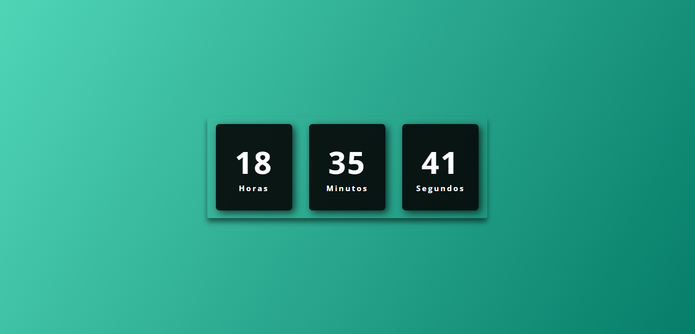

<h1 align="center"> Relógio Digital</h1>

Criação de um relógio que esteja sincronizado com a hora do computador.

  <a href="#-tecnologias">Tecnologias</a>&nbsp;&nbsp;&nbsp;|&nbsp;&nbsp;&nbsp;
  <a href="#-projeto">Projeto</a>&nbsp;&nbsp;&nbsp;|&nbsp;&nbsp;&nbsp;
  <a href="#-funcionalidades">Funcionalidades</a>&nbsp;&nbsp;&nbsp;

 

  

## 🚀 Tecnologias

Esse projeto foi desenvolvido com as seguintes tecnologias:

- HTML
- CSS
- JavaScript
- Git e Github

## 💻 Projeto

O projeto _Relógio Digital_ foi realizado como estudo de aprendizado para aprimorar mais os conhecimento de HTML, CSS e JavaScript.

- [Acesse o projeto finalizado, online](https://jp-xaxa.github.io/relogio-digital/)

## ⚙️ Funcionalidade

O desafio foi a criação do layout simples de apresentação das horas atual, além disso, o projeto possui:

- Pagina responsiva
- Horas sincronizada
- Modo Dark e Light sincronizado com as horas
